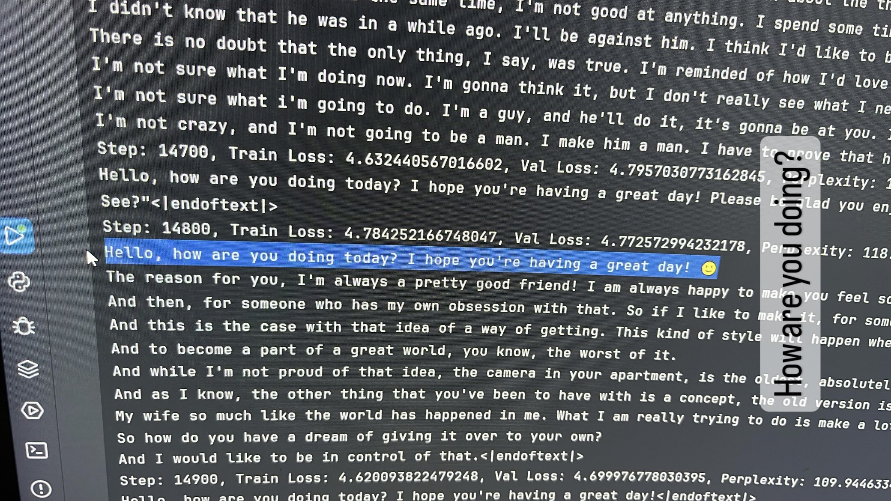

# BrainRot-GPT
**This is a GPT model but brain rot rizzler**

> [!IMPORTANT]
> *If you like this project, or find this project helpful, please give me a star. Thank you!*   
> The original training was done on 4 × H100 80GB GPUs. With DDP enabled, it roughly takes about 12 hours to complete training.  
> You can run the model with less powerful setup, but since this project is not yet done there is no weights released.  

> [!NOTE]
> If you have any questions or suggestions, please feel free to open an issue or pull request.  
> This project covers useful information about a self implemented GPT model  

## Structure
- `fineweb_dataset.py` — Downloads the FineWeb dataset from HuggingFace, splits it, and encodes it into binary format
- `dataloader.py` — Implements a Dataset class for loading binary files as torch tensors
- `model.py` — Standard implementation of GPT model
- `model_.py` (INCOMPLETE) — Optimized implementation of GPT model
- `train.py` — Handles model training, including optimization and checkpointing
- `eval.py` (INCOMPLETE) — Loads a trained model and generates sample outputs for evaluation

## Usage
*Warning* - Make sure to change all the hyperparameters to fit your needs
1. Run `fineweb_dataset.py` - `test.bin` and `train.bin` will be generated.
2. Run `train.py` - This will start the main training loop.
3. Run `eval.py` - This will load your saved model and generate sample texts.

## Features

- [x] Logging - Automated logging and checkpointing of model weights

- [x] Dynamic DDP - Can be set to which specific GPU to use
 
- [ ] SMS - SMS notification for when training is done

## FineWeb
The FineWeb dataset consists of more than 15T tokens of cleaned and deduplicated english web data from CommonCrawl. The one being used in the being used in this project is "sample-10BT", which covers 10 billion tokens (in gpt-2 coding) about size 30GB.

## Model
--- `[+,-]` for better or worse, `[P,L]` for performance or loss, `*` for minimal effects ---

### Standard Model
The **standard implementation** can be found in `model.py`.  
This version has minimal changes from the original GPT-2 model:

- [x] Causal Attention - Flash Attention `[P+++]`   Flash attention allows GPU to calculate Attention Mechanism Faster

- [x] GELU - 'tanh' performance optimization  `[P+, L*-]`   Tanh approx allows faster calculation with minimal loss to accuracy

- [x] Attention Block - Pre-norm instead of Post-norm  `[L+]`   Pre-norm generally yields better loss compare with Post-norm

- [x] Encoder - "cl100k_base" Tokenizer  `[P--, L++]`   Upsizing vocab_size and better encoding can result in better relative loss

- [x] Generation - Pre-allocated generation buffer  `[P+]`   Improves performance by trading off a bit of memory usage

### Optimized Model
The **optimized implementation** can be found in `model_.py`.  
This version focuses on improvements over the standard model.  
*Currently in progress:*

- [x] Causal Attention - Grouped Query Attention  `[P+++, L-]`   Saves massive amount of memory for worse loss, this can be covered by scaling up parameters

- [x] Attention Block - RSM Norm  `[P+, L*+]`   RSM Norm does less computation, yields better result in most cases

- [x] Positional Embedding - ROPE  `[P-, L++]`   ROPE Embedding allows more accurate positional embedding

- [x] MLP - SwiGLU  `[P-, L+]`   Smoother GELU activation, not sure why it is better

- [x] Bfloat16 - Bfloat16 `[P+, L*-]`   This allows the model to use bfloat16 instead of float32, which saves a lot of memory and computation

- [x] Generate `[P+, L+]` - K, V caching for faster generation, saving computing power but requires more memory

### Deepseek Model
The **Deepseek implementation** can be found in `model_deepseek.py`.
This version focuses on all the techniques that are used in Deepseek's GPT model.
*Future progress*

- [ ] Casual Attention - MLA (Multi Layer Attention) `[P++, L*-]`   This is a new technique that allows the model to learn better attention mechanism

- [ ] MOE - Mixture of Experts `[P++, L*-]`   Activate only a few experts in each layer, this allows the model to learn better attention mechanism

- [ ] GOPE - 

### CUDA Optimizations
**Note**: Some of these optimizations might be automatically turned on, or might overlap with each other.
torch.nn.parallel.DistributedDataParallel `[P+++++]`  - Stands for `Distributed Data Parallel`, allows multiple nodes, gpus in each node to work together.  
torch.backends.cudnn.benchmark `[P*+]` in LLM  - Allows pytorch to auto tune CNN convolution algorithm.  
torch.backends.cuda.matmul.allow_tf32 `[P++]`  - Allows GPU to enable tf32 format in matmul requires GPU support.  
torch.set_float32_matmul_precision `[P...P++]`  - Set matmul precision trading speed for accuracy.  
torch.optim.AdamW `[P*+]`  - Fused speeds up the computation but requires GPU support.  
torch.compile `[P+++]`  - Compile model into one to improve performance.  
torch.autocast `[P+++]`  - Enable automatic mixed precision to float16 or bfloat16, saves massive computation and memory decrease accuracy.  

## Goal
The final product should talk in Gen-Z terms towards given prompt, hence the name Brain-Rot GPT.

## Todos
- [x] Finish Working GPT Model
- [ ] Implement optimized version of Model
- [ ] Set up own scrapper for custom dataset (reddit comments)
- [ ] LORA finetune for BrainRot GPT
- [ ] Test and release
- [ ] Custom Tokenizer <- not sure if needed